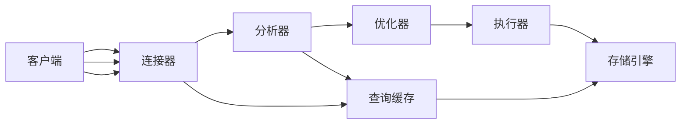
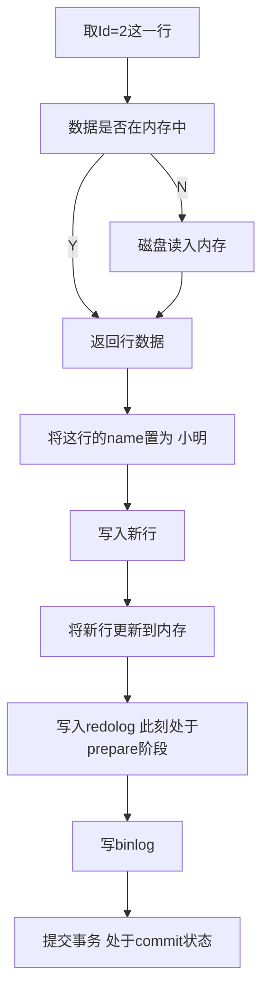

# 概览

## SQL查询语句执行步骤

<pre>
1. 连接器: 连接管理,权限管理  
2. 分析器: 词法分析,语法分析  
3. 查询缓存: 命中则直接返回  
4. 优化器: 执行计划生成，索引选择  
5. 执行器: 操作引擎、返回结果  
6. 存储引擎: 存储数据，提供读写接口
</pre>

## SQL更新语句执行步骤

Mysql WAL (Write-Ahead Logging):先写redo日志，再写磁盘 物理日志(主要作用是保证crash-safe的能力)

write pos(写入缓存的点) 和 check point(check过可以写log的点)  (check point) - (write pos)=可以写入日志的区域

binlog (Server) 逻辑日志(主要作用是数据同步)

更新语句的执行流程
<pre>
update t_student set name = '小明' where id =2
</pre>

## 索引

### 索引的常见模型

1. Hash
2. 有序数组
3. N叉树

### InnoDB索引模型

### 索引的维护

### 回表的概念

### 覆盖索引

### 索引下推

## 常见的索引场景

### 可以使用索引的关键字

= in like 'XX%' order by join 

### 不能使用索引的场景

1. 隐式转换

<pre>
错误用例:
select name from t_student where id = '213'
正确用例:
select name from t_student where id = 213
</pre>

2. 函数或表达式

<pre>
错误用例:
select name from t_student where date_format(a.create_time, '%Y-%m-%d')
正确用例:
select name from t_student where date_format(a.create_time, '%Y-%m-%d')
</pre>

3. 全匹配
<pre>
错误用例:
select id from t_student where name like '%小%'
正确用例
select id from t_student where name like '小%'
</pre>

4. or操作符
<pre>
错误用例:
select id from t_student where age = 13 or name = '小明'
正确用例:
select id from t_student where age = 13
union
select id from t_student where name = '小明'
</pre>