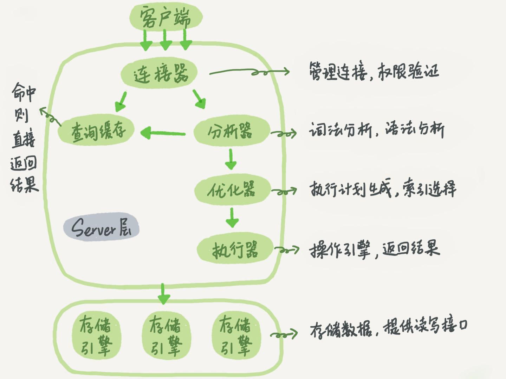

# 概览

总体来说数据库分为Server层和存储引擎层两部分
在SQL执行过程中，分别会经过客户端连接器->查询缓存->分析器->优化器->执行器->存储引擎的链路

## 1 Server层

> server层包括连接器、查询缓存、分析器、优化器、执行器等。涵盖数据库大部分的功能，比如内置函数、存储过程、触发器及视图等

## 2 存储引擎

> 存储引擎层负责数据的存储和提取，架构模式是插件式的，支持InnoDB、MySAM、Memory。默认的存储引擎是InnoDB

## 3 连接器

> 连接器负责和客户端建立连接(TCP连接)，获取权限、维持和管理连接(包括比如Navicat连接过程其实也是和连接器打交道)
> 可以使用show processlist命令看到连接
> 客户端如果太长时间没有操作，连接器就会自动将其断开，这个时间是由参数 wait_timeout 控制的，默认时间是3小时

## 4 查询缓存

* 强调一点:Mysql 8.0开始已经没有缓存的概念了

> Mysql拿到一个查询请求后，会先到缓存中查询是否有此语句的执行结果，缓存可能是KV形式，sql是Key，结果是V，如果你的查询能直接在这个缓存中找到key，那么直接返回结果
> 建议不使用MySql的缓存，原因如下:
<pre>
查询缓存的失效非常频繁、只要有对表的更新，这个缓存就会被清空。所以对于更新压力非常大的数据库来说，查询缓存的命中率非常低
</pre>
> SQL的缓存支持按需生成的:将query_cache_type设置为DEMAND，那么只有显式的指定才能使用缓存，如下:
<pre>
select SQL_CACHE * from table where id = 1
</pre>

## 4 分析器

> 词法解析、语法分析

## 5 优化器

> 优化器决定使用索引的情况，或者调整join的顺序等。优化器质性完成之后SQL执行的方案就确定下来了

## 6 执行器

> 执行之前需要判断权限
> select * from T where id=10; 执行说明

ID字段不存在索引的执行流程
<pre>
1. 调用InnoDB引擎接口获取这个表的第一行，判断ID是否为10，如果不是则跳过，如果是则存在结果集中
2. 调用引擎接口获取下一行，重复相同的逻辑，直到取到这个表的最后一行
3. 执行器将上述的结果集返回给客户端
</pre>

ID字段存在索引的情况和上述情况类似