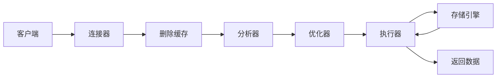

# 概览

本章从日志写入层面去讨论一条更新语句的执行过程

## 1 执行流程

update t set c=c+1 where id=2



## 2 redo log 和 undo log

### 2.1 redo log

日志处理的总流程是WAL

```
WAL: write ahead logging 关键在于先写日志，再写磁盘。即数据操作先记录在日志中，然后定期将数据更新到磁盘中。
InnoDB的redolog是固定大小的，当写满了之后就会停下来将一部分缓存中的数据刷新到磁盘中，
从而腾出缓存空间用于继续写入数据。在写日志时，可以类比成一个环，存在write pos和check point。check point向着相同方向进行循环，从write pos向前直到check point之间的是空白页，可以写入，如果write将一圈都写满了。那么数据库会停下来先做flush disk的操作，当有新的缓存
空间供写入时才能进行下一步的更新操作，如下图
```


```
拥有了redo log之后，InnoDB就可以保证数据不会丢失，这个能力就叫做crash-safe
```

### 2.1 binlog

```
binlog是属于Server层的，也叫归档日志
之所以Mysq Server要提供这样的能力是因为上面的wal是InnoDB提供的能力，作为Server应该具备这
样的原子能力(比如MyISam就没有日志的能力)。
```

* binlog 和 redo log的不同

1. redo log是InnoDB特有的，binlog是Server层的，所有引擎都可以使用
2. redo log是物理日志，记录的是”在什么数据页上做了什么修改“，binlog记录的是逻辑日志，记录的是DML和DDL对于schema或者数据的修改
3. redo log是循环写的，空间会用完，binlog是追加的，写到一定大小会切换到下一个文件写入

* update执行流程


* 两阶段提交
  
```
上述的redo log的写入分为了两个阶段，即prepare和commit
为什么要两阶段提交呢?
答案是: 让两份日志之间的逻辑保持一致

redo log用于恢复数据，binlog用于同步数据。如果两个逻辑不一致会导致数据和原数据不一致
这个可以使用反证法，具体证明从略
```