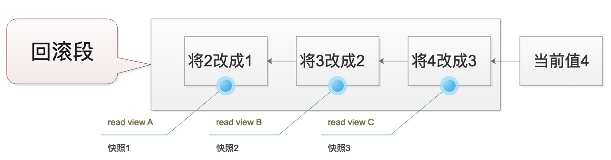

# 概览

本文档讲解Mysql中的事务隔离

## 隔离性和隔离级别

* ACID (Automicity、Consistency、Isolation、Durability) 原子性、一致性、隔离性和持久性

* 可能遇见的问题: 脏读、不可重复读、幻读

* 隔离级别: 读未提交 (Read Uncommited),读提交(Read Commited)、可重复读(repeatable read)和串行化(serializable)
  
```
1. 读未提交: 一个事务还没有提交时，它所做的变更就能被别的事务看见
2. 读提交: 一个事务所做的变更必须要提交之后其他的事务才能看见
3. 可重复读: 一个事务看到的数据和这个事务在启动时看到的数据是一致的。
4. 串行化: 对同一行数据，写会加写锁，读会加读锁。当读写锁冲突时，后一个事务必须等待前一个事务执行完成才能继续执行

在实现上述功能时，数据库里面会创建一个视图，访问的时候以这个视图中的逻辑结果为准。  
在"可重复读"隔离级别下，这个视图实在事务启动的时候创建的。  
在"读提交"隔离级别下，这个视图实在SQL执行的时候创建的。
在"读未提交"隔离级别下，没有视图，直接读取数据库的真实数据
在"串行化"隔离级别下，是通过直接加锁形式避免并行访问
```

## 事务隔离的实现

```
在Mysql中，每次对记录的更新都会同时记录一条回滚操作。记录上的最新值都可以通过回滚操作得到前一个状态的值。
```



```
那么回滚日志什么时候删除呢?答案是没有比这个回滚日志更早的read_view的时候(回想一下我们实现事务的时候使用的是视图)
```

* 优化点: 避免使用长事务

## 事务的启动方式

```
1. 显示使用启动事务语句: begin或start transation。配套的提交语句为 commit，回滚语句为rollback
2. 就要Spring的声明式事务
```